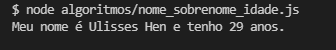
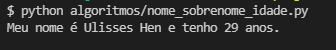
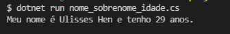

## Algoritmos simples em Javascript, Python e C#

O intuito desses algoritmos é demonstrar o uso de linguagens de programação de uso profissional em algoritmos simples que foram executados em aula utilizando-se o Visual G.

Segue exemplo em [Javascript](https://pt.wikipedia.org/wiki/JavaScript) ([Nodejs](https://pt.wikipedia.org/wiki/Node.js))


``` Javascript
var nome = 'Ulisses'
var sobrenome = 'Hen';
var idade = 29;

console.log('Meu nome é ' + nome + ' ' + sobrenome + ' e tenho ' + idade + ' anos.');
// exibe: Meu nome é Ulisses Hen e tenho 29 anos.
```
veja online [clique aqui](http://jsfiddle.net/9ug8d7yx/1/)  


Execução do algoritmo em js:  
  


examplo em [Python](https://pt.wikipedia.org/wiki/Python)
``` Python
nome = 'Ulisses'
sobrenome = 'Hen'
idade = 29

print('Meu nome é ' + nome + ' ' + sobrenome + ' e tenho', idade , 'anos.')
# exibe: Meu nome é Ulisses Hen e tenho 29 anos.
```
Execução do algoritmo em python:  
  

E também em [C#](https://pt.wikipedia.org/wiki/C_Sharp):
```C#
var nome = "Ulisses";
var sobrenome = "Hen";
var idade = 29;

Console.WriteLine("Meu nome é " + nome + " " + sobrenome + " e tenho " + idade + " anos.");
// Exibe: Meu  nome é Ulisses Hen e tenho 29 anos.
```
Execução do algoritmo em c-sharp:  
  

---

Bom é isso. É bem simples, mas é programação, e eu gosto.

