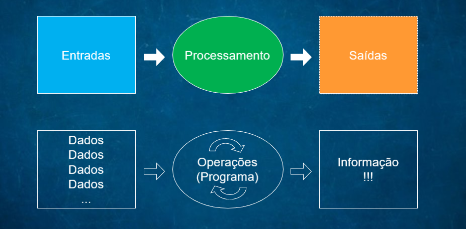

### O que é Tecnologia da Informação? 
Trecho do wikipédia que define genericamente a pergunta:  
Tecnologia da Informação (TI) é um conjunto de todas as atividades e soluções providas por recursos de computação que visam a produção, o armazenamento, a transmissão, o acesso, a segurança e o uso das informações. Na verdade, as aplicações para TI são tantas — e estão ligadas a tantas áreas — que há diversas definições para a expressão e nenhuma delas consegue determiná-la por completo. É, ainda, a área da informática que trata a informação, a organização e a classificação de forma a permitir a tomada de decisão em prol de algum objetivo. Fazendo uso de recursos computacionais físicos.  

### Como a TI está na vida das pessoas?

A TI está na vida das pessoas por meio dos computadores portáteis, computador pessoal e qualquer outro produto eletrônico que resolva problemas reais envolvendo a informação por intermédio do poder computacional que esses dispositivos podem fornecer. Dentre eles podemos citar: calculadora, mp3 player, celular, netbook, notebook, smartphone, etc. O uso efetivo da TI se dá ao fazer uma soma, reproduzir um audio, fazer uma ligação, acessar sites, etc.

### Qual o papel da TI nas Organicações?

Auxilia predominantemente em áreas de negócios de quase todos os segmentos atuais. Para uma empresa do ramo financeiro o uso da TI é visto nas transações bancarias, na facilitação que uma aplicação para o cliente pode ser possível, por exemplo, criar uma conta, fazer transferências, fazer pagamentos. Isso sem sair de casa e com o uso de um smartphone. Há ainda o uso de Inteligência Artificial pelas organizações para ajudar em tomadas de decisões de negócio baseada em varios parâmetros, uma vez que esse serviço geralmente é repetitivo e então é usado sistemas computacionais para deminiur ou o trabalho ou o número de falhas, ou ainda os dois.

----

### O que foi a Terceira revolução industrial?

### Como este período contribuiu para a evolução da TI e para o que a TI representa hoje no mundo dos negócios e na vida das pessoas? 

### Referências:
[Tecnologia da informação - Wikipédia](https://pt.wikipedia.org/wiki/Tecnologia_da_informa%C3%A7%C3%A3o)
